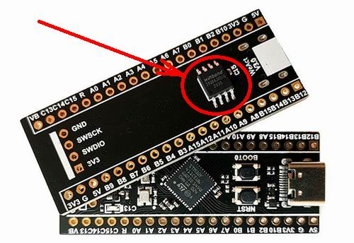

# W25Qxx Universal Driver v2.0


## Usage example for STM32F401 [BlackPill v3.0 board](https://stm32-base.org/boards/STM32F401CEU6-WeAct-Black-Pill-V3.0)

Recommended `arm-none-eabi-gcc` version: `10.3`

### Compiling and running the example
#### Requirements:
- installed [arm-none-eabi-gcc](https://developer.arm.com/downloads/-/gnu-rm)
- installed [openocd](https://openocd.org/pages/getting-openocd.html)
- having `STM32F401 BlackPill v3.0` board with `W25Qxx` chip soldered as shown on the picture above
- having [STLink V2](https://www.st.com/en/development-tools/st-link-v2.html) debug probe (_or anything else, but then `openocd` flags will require tweaking_) [(~$2 on Amazon)](https://www.amazon.com/s?k=st-link-v2)
- having USB-UART converter like `PL2303` for viewing output [(~$5 on Amazon)](https://www.amazon.com/s?k=PL2303)
#### Compile and flash application:
Unix:
```bash
./build.sh -f
```
Windows:
```cmd
build.cmd -f
```

Expected output:
```C
Starting @ 84MHz
Chip 1 UID: 'D1629C7803330A'
Manufacturer:	WINBOND
Dev_type:	W25Q64
Dev_cap:	8192 Kbytes
Interface:	SPI
Intf_mode:	NORMAL
Addr_mode:	3B
VCC x10:	27..36
Supply curr:	25 ma
Temp_range:	85*C..-40*C
Driver vers:	2.0

Chip 1 read data: [4 bytes @ 0x00000000]: 12345678
```